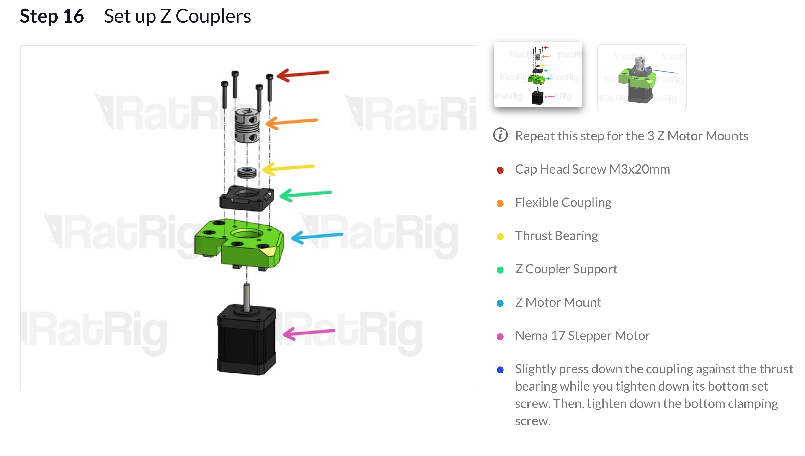

!!! question ""
    V-Core 1 :fontawesome-solid-chevron-right: V-Core 2 :fontawesome-solid-chevron-right: V-Core Pro 1.0 :fontawesome-solid-chevron-right: V-Core Pro 1.1 :fontawesome-solid-chevron-right: V-Core Pro 1.2 :fontawesome-solid-chevron-right: **V-Core Pro 1.3** :fontawesome-solid-chevron-right: V-Core 3

# V-Core Pro 1.3

v1.3 is the final iteration of the V-Core Pro DIY CoreXY 3D Printer kit. 

Developed on top of the v1.2 build, this version completely redesigns the Z axis of the machine to incorporate the 3 point kinematic bed feature which we introduced in the [V-Core 3](https://v-core3.ratrig.com/).

v1.3 is available as an upgrade kit from v1.1 and v1.2 at www.ratrig.com.

## User Testimonies

>The new v1.3 comes with the most precise Z drive mechanism I ever found in a 3D printer. After one trim operation, the bed squareness is below 0.02mm on a 300x300 bed. It doesn't get better than that! Simple and clear: it is a huge improvement for the Z axis. The old concept with two rails on the sides never glided as smoothly as the new one - there was always a bit of friction in the rails which caused noise. I didn‘t know any better and thought it was standard for a machine with 3 z motors, and I was a bit skeptic about the new design. Now, after one month of operation, I know better. The new Z drive is smoother. It runs so silent I can be in the printer-room and don‘t notice the moving bed.

Detlev Rackow

>Much easier to assemble and get right. Much better bed support, especially on large beds. I went from a 1.4mm height variance to just 0.3mm on the 1.3 on my 500mm bed! That's just INSANE! I would highly recommend this upgrade to everyone!

Mikkel Schmidt

## Precision

- [x] 3 Point Kinematic Bed

- [x] All movement guided by MGN15 Linear Rails

&nbsp;

## Robustness

- [x] Frame made with 2020 and 2040 V-Slot aluminium with a beautiful black anodization
- [x] 3mm thick anodized aluminium plates
- [x] 9mm Belts
- [x] Weight of Z drivetrain and bed is distributed across the Z motor mounts - not on the motors themselves

## EVA

- [x] The EVA Carriage System provides mounts for most popular extruder and hot end choices on the market (Bowden, BMG, Titan, Aero, Hemera, and more to come!)
- [x] Shipping with EVA 2.2.1

!!! tip end "What is EVA?"
    EVA is an independently developed and maintained project that aims to be a single platform for many extrusion types.

    **Copperhead** and **Bondtech LGX** support incoming!

    Note that not all print head types (due to their physical dimensions) can achieve the full 300x300 print space.
    

EVA 2 is the next iteration of the EVA platform with which V-Core Pro is fully compatible. Most vivid improvements since the last iteration is the improved front belt clamp feature (no more zip ties!), improved contribution system, more ease of assembly, modular X endstop system, dedicated cable paths and shrouds (for ascetics).

Read more about EVA on: [:octicons-octoface-16: EVA 2 Documentation](https://main.eva-3d.page/)

## Build guide

- [x] Fully comprehensive step by step [build guide](https://ratrig.dozuki.com/c/Rat_Rig_V-Core_Pro_1.3)

## Community

- [x] Join our <a href="https://www.facebook.com/groups/ratrig3dprintercommunity" target="_blank">Facebook 3D Printer Community</a> to connect with other V-Core users, share builds, knowledge, mods, and stay posted on all V-Core Pro developments.

## Convenience

- [x] Designed for a far easier and quicker assembly than previous versions

## Modding

The V-Core Pro is the perfect printer for advanced users who like to tweak and tinker with their machine:

- [x] Fully open-source design, with downloadable 3D models and part libraries freely available
- [x] Frame is built on a modular platform of V-Slot profiles, which allow for endless possibilites when it comes to mounting all types of parts 
- [x] Vast catalog of stand-alone parts available for infinite upgradeability: screws, nuts, connectors, brackets, pulleys, belts, electronics, etc 

[Order Now!](https://www.ratrig.com/rat-rig-v-core-pro-upgrade-kit-from-v-core-pro-1-x-to-1-3.html){: .md-button .md-button--primary target=_blank }

## CAD

For the CAD 3D Model refer to: [:fontawesome-solid-folder-open: Fusion 360]( https://myhub.autodesk360.com/ue2b141fd/g/shares/SH56a43QTfd62c1cd96856b6c56275f6373a){ target="_blank" }

## Printed Parts 

The whole repository, with CAD files can be downloaded under the following link:  
[:material-download-box: Download All](https://github.com/Rat-Rig/V-Core-Pro-1.3/archive/main.zip){: .md-button .md-button--primary}

{{ printed_parts_bom("V-Core-Pro/bom/printed_parts.csv", "https://github.com/Rat-Rig/V-Core-Pro-1.3") }}

## BOM 

### Rat Rig V-Core Pro - Upgrade Kit from V-Core Pro 1.x to 1.3

{{ hardware_bom("V-Core-Pro/bom/V-Core Pro 1.3 BOM - Base.csv") }}

### FROM 1.2 (V-Core Pro 1.3 Upgrade kit)

{{ hardware_bom("V-Core-Pro/bom/V-Core Pro 1.3 BOM - FROM 1.2.csv") }}

### FROM 1.1 (V-Core Pro 1.3 Upgrade kit)

{{ hardware_bom("V-Core-Pro/bom/V-Core Pro 1.3 BOM - FROM 1.1.csv") }}
